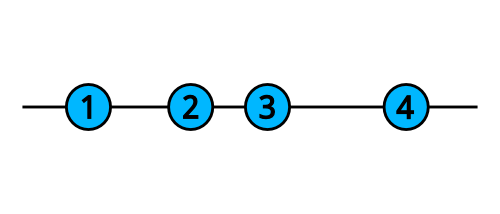
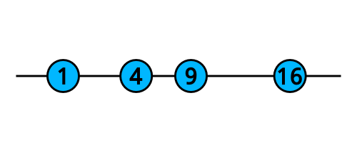
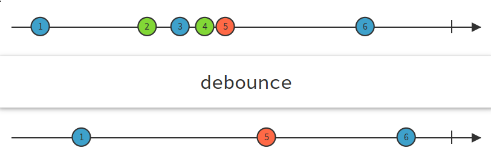
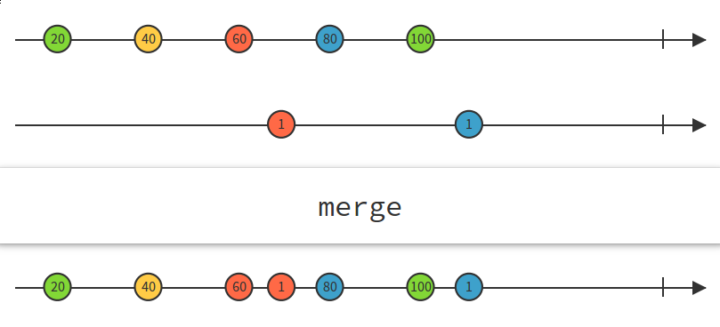

#### Rxjava Tutorial 구현

1. 오퍼레이터가 io 쓰레드에서 호출되게 하기(Not Ui Thread)
2. PrograssBar 넣기
3. 검색 입력 텍스트 변화 감지(Text wacher)
4. Filter Query 글자수를 통해 경우의 수 조정
5. Debounce operator (글자가 바뀔 때마다 매번 서버에 새로운 요청을 하지 않기 위해)
6. Merge(TextField + button)
7. Disposal 처리 (@onStop)

```java
myObservable // observable will be subscribed on i/o thread
  .subscribeOn(Schedulers.io())
  .observeOn(AndroidSchedulers.mainThread())
  .map(/* this will be called on main thread... */)
  .doOnNext(/* ...and everything below until next observeOn */)
  .observeOn(Schedulers.io())
  .subscribe(/* this will be called on i/o thread */);
```

**[The Map Operator]**

map 오퍼레이터는 observable이 전달하는 아이템들 각각에 적용되고, 그 오퍼레이션으로 변형된 다른 형태의 아이템을 전달하는 observable을 리턴한다.
숫자들을 전달하는 아래와 같은 numbers라는 observable이 있다



```java
numbers.map(new Function<Integer, Integer>() {
  @Override
  public Integer apply(Integer number) throws Exception {
    return number * number;
  }
}
```



**[Debounce operator]**

글자가 바뀔 때마다 매번 서버에 새로운 요청을 전송하기를 원하지는 않을 것이다.
debounce는 reactive 패러다임의 진짜 효용성을 보여주는 오퍼레이터 중의 하나이다. filter 오퍼레이터처럼 debounce도 observable이 전달하는 아이템들을 필터링한다. 다만 아이템들 중에 어떤 아이템이 필터를 통과할지는 아이템이 무엇인지가 아니라, 언제 아이템이 전달되느냐에 따라 결정된다.
debounce는 다음 아이템을 전달할 때까지 특정 시간동안 기다린다. 기다리는 시간동안 아무런 아이템이 전달되지 않았다면, 마지막 아이템이 전달된다.




**[Merge Operator]**

버튼 클릭에 반응하는 observable을 만들었고, 텍스트 필드 변화에 반응하는 observable도 만들었는데, 어떻게하면 둘다에 반응할 수 있을까? 이런 경우 observable들을 합칠 수 있는 오퍼레이터들이 많이 있다. 가장 간단하고 유용한 오퍼레이터가 merge이다. merge는 두개 이상의 observable에서 아이템을 받아서 하나의 observable로 전달한다.



```kotlin
val buttonClickStream = createButtonClickObservable()
val textChangeStream = createTextChangeObservable()

val searchTextObservable = Observable.merge<String>(buttonClickStream, textChangeStream)

```

**[Flowable 클래스]**

Flowable은 RxJava 2.x에 새로 도입된 클래스입니다. RxJava에는 Observable 클래스의 수많은 변형이 존재하는데 Flowable은 배압backpressure 이슈를 위해 별도 분리한 클래스 입니다.

참고로 기존의 RxJava 1.x 에는 Observable이 배압 관련된 함수를 포함했었습니다.

Flowable 클래스를 도입한 이유는 Observable 클래스의 성능을 향상시키기 위해서 입니다.

기존의 Observable 클래스는 배압에 관한 처리가 불필요한 경우에는 초기 로딩 때문에 약간의 오버헤드가 있었습니다. 하지만 RxJava 2 의 Observable 클래스에는 배압으로 인한 성능 오버헤드가 사라졌습니다.

Flowable 클래스의 활용은 기본적으로 Observable과 동일합니다. 또한 Flowable에서 Observable 로 변환하는 것이나 Observable에서 Flowable로 변환하는 것도 어렵지 않습니다.

변환을 위해 toObservable() 과 toFlowable() 함수를 제공합니다 

지금까지 배웠던 Observable과 동일하게 사용하면 됩니다.


**Observable과 Flowable 선택 기준**

RxJava 2.x 위키에는 Observable Flowable의 선택 기준이 공개되어 있습니다. 

먼저 Observable 을 사용해야 할 때는 다음과 같습니다


**- 최대 1,000개 미만의 데이터 흐름.** 예를들어 응용프로그램에서 OOME(Out of Memory Exception)이 발생할 확률 이 거의 없는경우입니다.

**- 마우스 이벤트나 터치 이벤트를 다루는 GUI 프로그래밍.** 이 경우에는 배압의 이슈가 거의 발생하지 않습니다. Observable로는 초당 1,000회 이하의 이벤트를 다루는데 이때 smaple() 이나 debounce() 같은 흐름제어 함수를 사용하면 됩니다.

**- 데이터 흐름이 본질적으로 동기 방식이지만 프로젝트에서 사용하는 플랫폼이 자바 Stream API나 그에 준하는 기능을 제공하지 않을 때.** Observable은 보통 Flowable과 비교했을 때 성능 오버헤드가 낮습니다.

한편 Observable 보다 Flowable을 선택해야 할 때는 다음과 같습니다.


**- 특정 방식으로 생성된 10,000개 이상의 데이터를 처리하는 경우 .** 이때 메소드 체인에서 데이터 소스에 데이터 개수 제한을 요청해야 합니다.

**-디스크에서 파일을 읽어 들일 경우.** 본직적으로 블로킹I/O 방식을 활용하고 내가 원하는 만큼 가져오는 방식(pull-based) 으로 처리해야하기 때문입니다. 예를들면 특정 단위로 잘라 몇 행씩 가져오도록 제어할 수 있습니다 .


**- JDBC를 활용해 데이터 베이스의 쿼리 결과를 가져오는 경우.** 블로킹 방식을 이용하므로 ResultSet.next() 를 호출하는 방식으로 쿼리의 결과를 읽어오도록 할 수 있습니다.

**- 네트워크 I/O를 실행하는 경우.** 네트워크나 프로토콜을 통해 서버에서 가져오길 원하는 만큼의 데이터양을 요청할 수 있을 때입니다.

**-다수의 블로킹 방식을 사용하거나 가져오는 방식(pull-based)의 데이터 소스가 미래에는 논 블로킹(non-blocking) 방식의 리액티브 API나 드라이버를 제공할 수도 있는 경우입니다.**

### backpressure?

우리말로 번역하면 ‘등 뒤에서 떠밀리는 압박’ 정도가 될 듯 하다.

이런 상황을 가정해보자. 콘서트장을 사람들이 가득 메웠다. 콘서트장에 들어오려는 사람들은 저글링 개떼처럼 밀려드는데 나가는 사람은 별로 없다. 콘서트장 출입구를 통제하는 요원이 없다면? 콘서트장이 터지던지 안에 있던 사람들이 짜부러지던지 아무튼 대형 사고가 발생할거다.

publish / subscribe 모델에서도 이런 비극적인 시나리오가 발생할 수 있다. 생산자는 미친듯이 element 를 생산해 내는데 소비자가 처리하는 속도가 이를 따라가지 못한다면

1. busy waiting 또는
2. out of memory exception 이 발생할 것이다.

‘등 뒤에서 떠밀리는 압박’ 에 대한 흐름제어를 위한 버퍼가 바로 backpressure buffer 다. 버퍼가 가득 차면 어차피 소비자는 element 를 처리할 여유가 없는 상태이므로 더 이상 publish 를 하지 않는다.

기존에 없던 개념이 새로 추가된 것은 아니다. 기존 rxJava 1.xx 의 경우 Observable 에 backpressure buffer 를 직접 생성해 주면 사용이 가능하다. 허나 rxJava 개발자는 초보자들이 미처 알아채지 못하는 영역에서 기대하지 않는 동작이 일어날 가능성이 있다며 Flowable 을 추가하였다.


참조

https://www.raywenderlich.com/2071847-reactive-programming-with-rxandroid-in-kotlin-an-introduction

https://beomseok95.tistory.com/233?category=1029204